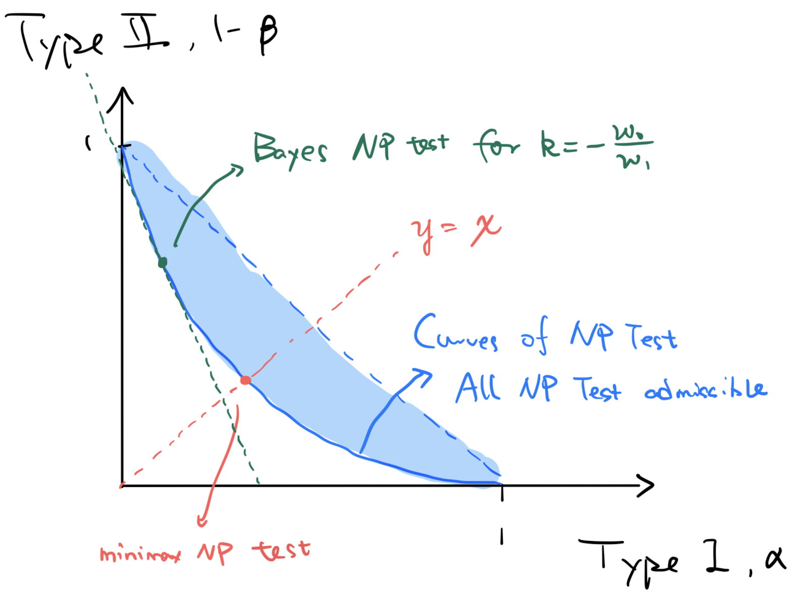

# Chapter 10 Decision theory

## Exam
- Risk 
    - definition 
    - examples 
- Admissibility 
    - definition 
    - examples (e.g. NP-test) 
- Minimaxity 
    - definition 
    - examples (e.g. NP-test) 
- Bayes 
    - definition 
    - examples (e.g. Bayes test) 
    - construction

question be like: give me the definition, show sth is ad minimax bayes, construction of bayes estimator    

## A summary for NP test 

## Definition of decision and risk

- A *loss function* is a map ``L: \Theta \times \mathcal{A} \rightarrow \mathbb{R}`` with ``L(\theta, a)`` being the loss when the parameter value is ``\theta`` and one takes action ``a``.
    - ``\mathcal{A}=\mathbb{R}`` corresponds to estimating a real-valued parameter.
    - ``\mathcal{A}=\{0,1\}`` corresponds to testing a hypothesis.
    - ``\mathcal{A}=[0,1]`` corresponds to randomized tests.
    - ``\mathcal{A}=\{\text { intervals }\}`` corresponds to confidence intervals.
- The *risk of decision* ``d(X)`` is defined as ``R(\theta, d):=E_{\theta} L(\theta, d(X)), \theta \in \Theta``
### Example
1. parameter estimation: ``L(\theta, a):=w(\theta)|g(\theta)-a|^{r}``, ``R(\theta, d)=w(\theta) E_{\theta}|g(\theta)-d(X)|^{r}``.
    1. special case of mean square loss``R(\theta, d)=E_{\theta}|g(\theta)-d(X)|^{2}``
2. Hypothesis test ``H_{0/1}: \theta \in \Theta_{0/1}``, ``\mathcal{A}=\{0,1\}``
    1. loss defined as error, ``c>0`` is a tunable parameter, ``L(\theta, a):= \begin{cases}1 & \text { if } \theta \in \Theta_{0} \text { and } a=1 \\ c & \text { if } \theta \in \Theta_{1} \text { and } a=0 \\ 0 & \text { otherwise }\end{cases}``
    2. ``R(\theta, d)= \begin{cases}P_{\theta}(d(X)=1) & \text { if } \theta \in \Theta_{0} \\ c P_{\theta}(d(X)=0) & \text { if } \theta \in \Theta_{1} \\ 0 & \text { otherwise }\end{cases}`` correspond to the error probabilities (type I and type II errors).

- **Notes** The best decision ``d`` is the one with the smallest risk ``R(θ, d)``. However, ``θ`` is not known. Thus, if we compare two decision functions ``d_1`` and ``d_2``, we may run into problems because the risks are not comparable: ``R(θ, d_1 )`` may be smaller than ``R(θ, d_2)`` for some values of ``θ``, and larger than ``R(θ, d_2)`` for other values of ``θ``.  
    - this leads to the following three optimality: **admissibility**, **minimaxity** and **bayesian**.

    
## 10.2 Admissibility
- **Definition** A decision ``d'`` is called *strictly better* than ``d`` if
    1. ``R\left(\theta, d^{\prime}\right) \leq R(\theta, d), \forall \theta``
    2. and ``\exists \theta: R\left(\theta, d^{\prime}\right)<R(\theta, d)`` 
    - When there exists a ``d'`` that is strictly better than ``d``, then ``d`` is called *inadmissible*.
- **Definition** A decision ``d'`` is called *admissible* than ``d`` if **for all** ``d'`` either
    1. ``\exists \theta_0`` such that ``R\left(\theta_0, d^{\prime}\right) > R(\theta_0, d),`` (``d`` strictly better than ``d'`` in some case, there might also be case where ``d'`` better than ``d``)
    2. or ``\forall \theta: R\left(\theta, d^{\prime}\right) \geq R(\theta, d)`` (``d`` no worse than ``d'`` in all case)

- **Notes** to test decision ``d`` is admissible, one has to take all possible ``d'`` into account.

**Examples** 
1. Ex 10.2.1: for location model, using one data is inadmissible
2. for parameter set ``\Theta`` where ``P_{\theta_0}`` dominatdes ``P_{\theta}, \forall \theta``, Then constant decision ``d:= g(\theta_0)`` is admissible. Proof
    1. ``R(\theta_0, d) = 0``, so if ``d'`` is better than ``d``, we have ``E_{\theta_{0}}\left|g\left(\theta_{0}\right)-d^{\prime}(X)\right|^{r} \leq 0``
    2. Using Mardov inequality, ``d^{\prime}(X)=g\left(\theta_{0}\right), P_{\theta_{0}}-\text { almost surely }``
    3. ``d'(X) = d(X)`` almost surely.
    
### Example: When NP test is admissible among all possible test?
- NP test is single point paramtere space test ``H_{0/1}: \theta=\theta_{0/1}``
- The risk is defined as the probability of error of first and second kind ``R(\theta, \phi):= \begin{cases}E_{\theta} \phi(X), & \theta=\theta_{0} \\ 1-E_{\theta} \phi(X), & \theta=\theta_{1}\end{cases}``
    - the test is ``\phi_{\mathrm{NP}}:= \begin{cases}1 & \text { if } p_{1} / p_{0}>c \\ q & \text { if } p_{1} / p_{0}=c \\ 0 & \text { if } p_{1} / p_{0}<c\end{cases}``
    - where ``p_{1/0}`` is the probability density function, ``c\geq 0``.

- recall that we **reject** ``H_0`` and **accept** ``H_1`` if ``\phi(X) = 1``, and vice versa
    - ``\alpha := E_{\theta_0} \phi(X)`` is the error of wrong rejection of ``H_0``
        - *type I error*
        - *false positive* (``H_0`` as negative)
        - **level** of a test.
    - ``\beta := 1 - E_{\theta_1} \phi(X)`` is the error of wrong acceptance of ``H_0``,
        - *type II error*
        - *false negative*
        - ``E_{\theta_1} \phi(X)`` is the **power** of a test

- **Lemma 10.2.2** A Neyman Pearson test is **admissible** *if and only if* <u>one of</u> the following two cases hold:
    1. its power ``E_{\theta_1} \phi(X) = 1 - R(1, \phi_{\mathrm{NP}})`` is strictly less than 1
    2. it has minimal level ``E_{\theta_0} \phi(X) = R(0, \phi_{\mathrm{NP}})`` among all tests with power 1.
- proof:
    1. By Neyman Pearson lemma, ``c(R(0, \phi_{\mathrm{NP}}) - R(0, \phi)) \leq R(1, \phi) - R(1, \phi_{\mathrm{NP}})``
    2. If ``\exists \phi`` strictly better than ``\phi_{\mathrm{NP}}``. 
        1. For example ``R(0, \phi_{\mathrm{NP}}) - R(0, \phi) > 0`` and ``R(1, \phi) - R(1, \phi_{\mathrm{NP}}) \leq 0``
        2. then ``0 \geq R(1, \phi) - R(1, \phi_{\mathrm{NP}}) \geq c(R(0, \phi_{\mathrm{NP}}) - R(0, \phi))``
    3. if ``c>0``, which is equivalent to case (i) leads to contradictary
    4. if ``c = 0``, always reject ``H_0``, which means power is 1, then we get ``R(0, \phi_{\mathrm{NP}}) - R(0, \phi) > 0`` which in contradict to case (ii).

    
## 10.3 Minimax decision
- **Definition** A decision ``d`` is called *minimax* if ``\sup _{\theta} R(\theta, d)=\inf _{d^{\prime}} \sup _{\theta} R\left(\theta, d^{\prime}\right)``.
    - best decision in the worst possible case

### Lemma 10.3.1 when a NP test is minimax
- **Lemma** A Neyman Pearson test ``\phi_{\mathrm{NP}}`` is minimax, if and only if ``r_0 := R\left(\theta_{0}, \phi_{\mathrm{NP}}\right)=R\left(\theta_{1}, \phi_{\mathrm{NP}}\right) =: r_1``
- Proof
    1. if ``r_0 = r_1`` and ``\phi_{\mathrm{NP}}`` not minimax, then exist test ``\phi'`` s.t. ``\max _{j} r_{j}^{\prime}<\max _{j} r_{j}``
        1. this means ``r_{0}^{\prime}<r_{0}, r_{1}^{\prime}<r_{1}``, impossible
    2. if  ``\phi_{\mathrm{NP}}`` minimax, but ``r_0 \neq r_1``, suppose ``r_0 < r_1``, which lies in ``y > x`` part of ROC curve. Since the set of test on ROC curve is convex, by superposition of ``\phi``s, the test ``\phi_X``of ``r_0 =1, r_1 = 0`` is also a point of all test, by linear combinatoin of ``\lambda \phi_{NP} + (1-\lambda)\phi_X``, we can always find  a better test in the region of ``y \geq x``.
        1. which is in contractary with minimax assumption
    

## 10.4 Bayes decision
- **Definition** The *Bayes risk* (with respect to the probability measure ``Π`` on parameter space ``\Theta``) is ``r(\Pi, d):=\int_{\Theta} R(\vartheta, d) d \Pi(\vartheta)``
    - if the distribution have density function ``w``, then ``r(\Pi, d)=\int_{\Theta} R(\vartheta, d) w(\vartheta) d \mu(\vartheta):=r_{w}(d)``
- **Definition** A decision ``d`` is called Bayes (with respect to ``Π``) if ``r(\Pi, d)=\inf _{d^{\prime}} r\left(\Pi, d^{\prime}\right)``

## 10.5 Construction of Bayes estimator
- **Definitoin 10.5.1** The *a posteriori density* of ``\theta`` is ``w(\vartheta \mid x)=p(x \mid \vartheta) \frac{w(\vartheta)}{p(x)}, \vartheta \in \Theta, x \in \mathcal{X}``
    - the marginal is ``p(x):=\int_{\Theta} p(x \mid \vartheta) w(\vartheta) d \mu(\vartheta)``

- **Lemma 10.5.1** Given the data ``X = x``, consider ``θ`` as a random variable with density ``w(ϑ | x)``. 
    - Let ``l(x, a):=E[L(\theta, a) \mid X=x]=\int_{\Theta} L(\vartheta, a) w(\vartheta \mid x) d \mu(\vartheta)``
    - then ``d(x):=\arg \min _{a\in \mathcal{A}} l(x, a)``
- *Proof* Again the idea is , by the give of Bayesian, change the order of integration, btw ``\theta`` and ``x``
    - ``r_{w}\left(d^{\prime}\right) = \mathbb{E}_{\theta\sim w(\vartheta)}\left[ R(\theta, d') \right] = \mathbb{E}_{\theta\sim w(\vartheta)}\left[ \mathbb{E}_{x\sim p(x|\theta)} \left[ L(\theta, d'(x)) \right] \right]``
    - with the use of Bayesian rule, ``r_{w}\left(d^{\prime}\right) = \mathbb{E}_{\theta\sim w(\vartheta)}\left[ R(\theta, d') \right] = \mathbb{E}_{x\sim p(x)}\left[ \mathbb{E}_{\theta\sim w(\vartheta|x) } \left[ L(\theta, d'(x))| x \right] \right] = \mathbb{E}_{x\sim p(x)}\left[ l(x,d'(x)) \right] ``
    - again the minimization term does not have intersectoin so ``d(x):=\arg \min _{a\in \mathcal{A}} l(x, a)`` is truely the minimum.

**The posterior mean minimum is Bayes!!!**

### Corollary 10.5.1, Bayes decision for Sufficient statistics
- If ``S`` sufficient, ``p(x|\theta) = g_{\theta}(S(x))  h(x)``, 
    - then ``l(x, a)= \int_{\Theta} L(\vartheta, a) w(\theta) g_{\theta}(S(x))  h(x)/ p(x) d \mu(\vartheta) = h(x)/ p(x) \int_{\Theta} L(\vartheta, a) w(\theta) g_{\theta}(S(x))   d \mu(\vartheta) ``
    - term ``h(x)/ p(x)`` does not affect minimization
    - so ``d(x):=\arg \min _{a\in \mathcal{A}} l(x, a) = d_{\text {Bayes }}(X)=\arg \min _{a \in \mathcal{A}} \int L(\vartheta, a) g_{\vartheta}(S) w(\vartheta) d \mu(\vartheta)`` only depends on ``S``.

### 10.5.1 when a NP test is bayes?
- using lemma 10.5.1, we have ``l(x, \phi)=\phi w_{0} p_{0}(x) / p(x)+(1-\phi) w_{1} p_{1}(x) / p(x)`` for loss ``L\left(\theta_{0}, a\right):=a, L\left(\theta_{1}, a\right):=1-a, a \in\{0,1\}``.
- then using the definition of ``d(x):=\arg \min _{a\in \mathcal{A}} l(x, a) `` we have 
    - ``\arg \min _{\phi} l(\cdot, \phi)= \begin{cases}1 & \text { if } w_{1} p_{1}>w_{0} p_{0} \\ q & \text { if } w_{1} p_{1}=w_{0} p_{0} \\ 0 & \text { if } w_{1} p_{1}<w_{0} p_{0}\end{cases}``
    - another proof is that ``r_{w}(\phi)=w_{0} \int \phi p_{0}+w_{1}\left(1-\int \phi p_{1}\right) = \int \phi\left(w_{0} p_{0}-w_{1} p_{1}\right)+w_{1}``
        - So we choose ``\phi \in[0,1]`` to minimize ``\phi\left(w_{0} p_{0}-w_{1} p_{1}\right)``.
- Note that ``2 r_{w}\left(\phi_{\text {Bayes }}\right)=1-\int\left|w_{1} p_{1}-w_{0} p_{0}\right|``. which means the risk is large if the two densities are close to each other.

### 10.5.2 Bayes estimator for quadratic loss 
- **small lemma 10.5.2** ``\arg \min _{a \in \mathbb{R}} E(Z-a)^{2}=E Z``, because ``E(Z-a)^{2}=\operatorname{var}(Z)+(a-E Z)^{2}``
- For quatratic loss ``L(\theta, a):=|\theta-a|^{2}``, ``l(x, a) =E[ (\theta - a)^2 \mid X=x]``
    - ``d_{\text {Bayes }}(X)=E(\theta \mid X)``

### 10.5.3 Bayes estimator is approximately maximum a posteriori estimator (MAP)
- under assumption of ``L(\theta, a):=1\{|\theta-a|>c\}``
    - so ``l(x, a)=\Pi(|\theta-a|>c \mid X=x)=\int_{|\vartheta-a|>c} w(\vartheta \mid x) d \vartheta``
    - ``\frac{1-l(x, a)}{2 c}=\frac{\Pi(|\theta-a| \leq c \mid X=x)}{2 c} \approx w(a \mid x)=p(x \mid a) \frac{w(a)}{p(x)}``

